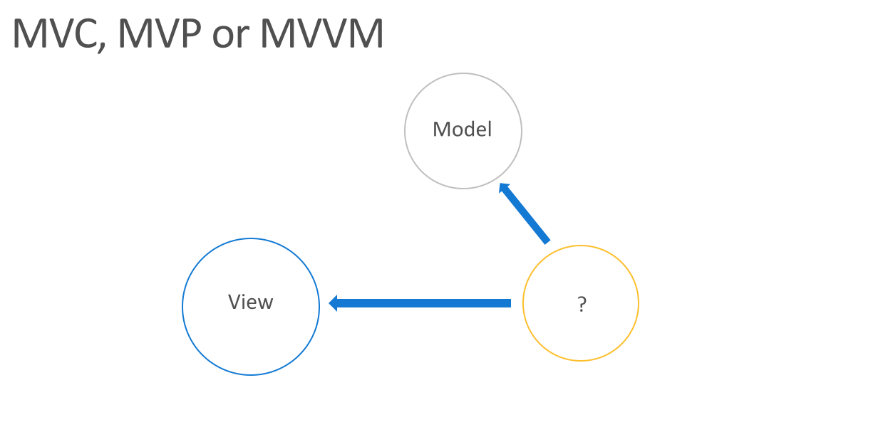

# XamarinDevDays - Hanoi 2017

Xamarin Dev Days - Hanoi 2017 is an annual event for Xamarin Developers community in Hanoi.

## What does this repo contain?

This repo contains sample code for applying MVC, MVP and MVVM in Xamarin. The slide could be found [here](./slides/xamarindevdays_hanoi_2017_designsnpractices.pdf)

Each pattern is located in its own branch, except MVVM is considered the main one and located in `master` branch

Beside MV* patterns, there is also code for demontration on using Xamairn.UITests which could found in 2 branches
- demo-timepicker: Demo how to use UITests to set a time
- ui-tests: Demo how to use UITests

## Authors
- [Tuyen Vu](https://github.com/tuyen-vuduc/)
- [Binh Do](https://github.com/dothanhbinh41/)

## LICENSE
The code is licensed under [GNU LESSER GENERAL PUBLIC LICENSE v3](./LICENSE).